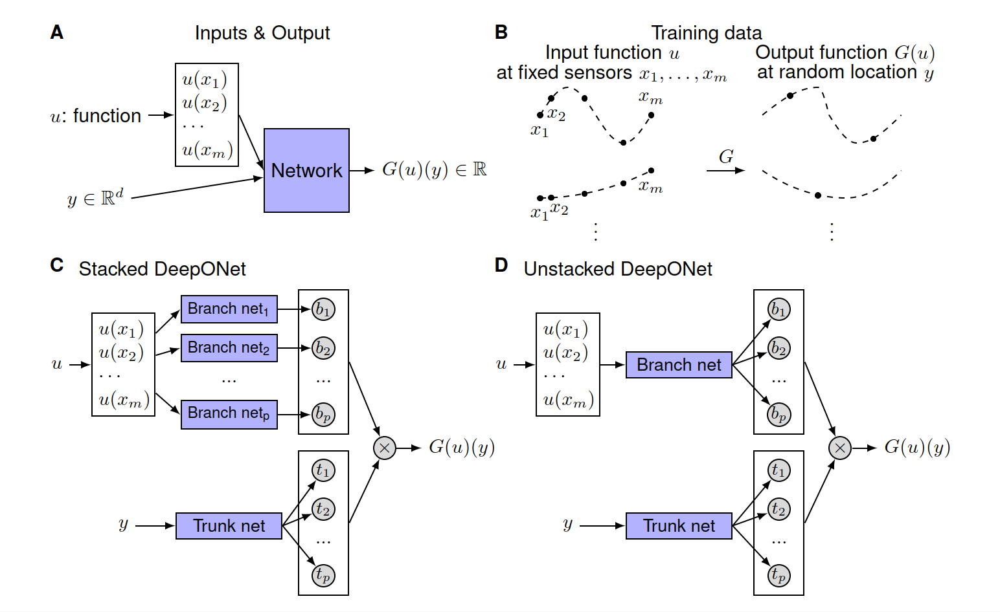
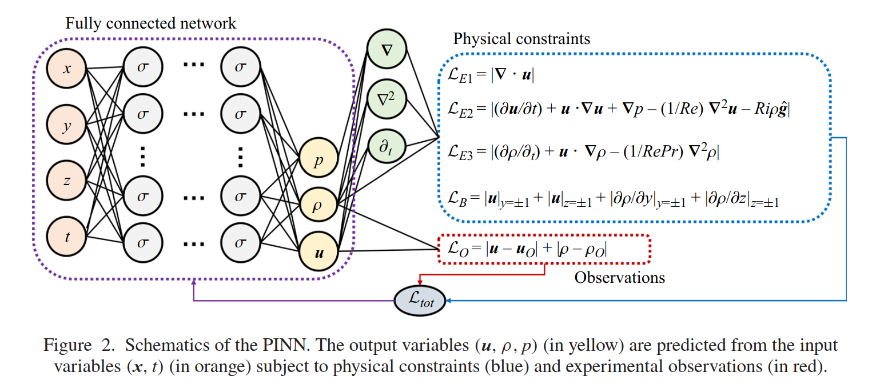

1. **DD-PINN (DT perspective) paper:** 
     
    - Data-PINN better than no data PINN (only physics) - minima are steeper for DD-PINN.
    - *Sampling*: Random sampling works best for DD-PINN. For ND-PINN (ND: No data) we can use various types of sampling like gradient based, etc. Eg. vorticity based, residue based sampling. (Basically train the model somewhat. Then identify when/where the model can't predict so accurately, sample more training points from that region). Also can define probability distribution for sampling.
    - For those parameters due to which high frequency changes occur (eg. high Reynolds number), we can use multiscale sampling. Eg. sample from 20x20 grid for low Reynolds number and 160x160 grid for high Reynolds number.

1. **DeepONet:**
     
    - It has two parts: Branch net and trunk net. 
    If $G(y)(u): u(x) \longmapsto s(x)$ then we would tell the function $u(x)$ to the branch net (discretized) and the trunk net would take $y$ as input and output $s(y)$.
    
    - **Only condition required is that the sensor locations ${x1, x2, . . . , xm}$ are the same but not necessarily on a lattice for all input functions $u$, while we do not enforce any constraints on the output locations $y$.** So, we must fix values of x beforehand.
    - We can use any type of NN for branch and trunk, *for a more general setting we may use the “attention” mechanism*.
    - They used two function spaces: Gaussian random field (GRF) and orthogonal (Chebyshev) polynomials.
    - **Unstacked DeepONets with bias achieve the best performance.**
    - During training, Because s(x) may explode for certain u, we compute the test MSE by removing the 0.1% worst predictions.
    - To predict s for a longer time, more sensors are required, i.e. more x positions.
    - (See last example in the paper, solves diffusion equation.)

1. **New insights into experimental stratified flows obtained through physics-informed neural networks:**
     
    

1. **Neural ODE:**
     
    - We predict dy/dt [= f(y,t)] using a NN. Then we get y(t) by integrating dy/dt using an ODE solver. Then we take loss between predicted y(t) and actual y(t) and backpropagate using adjoint sensitivity method.
    - We can use any ODE solver, but the paper used the Dormand-Prince method.
    - **READ THE PAPER ONCE MORE. NEED MORE UNDERSTANDING.**
    - [ChatGPT Chat](https://chatgpt.com/share/686562da-ebbc-800e-a12a-fa6c6e0ce741) - See last 2-3 messages for summary and key points.
    